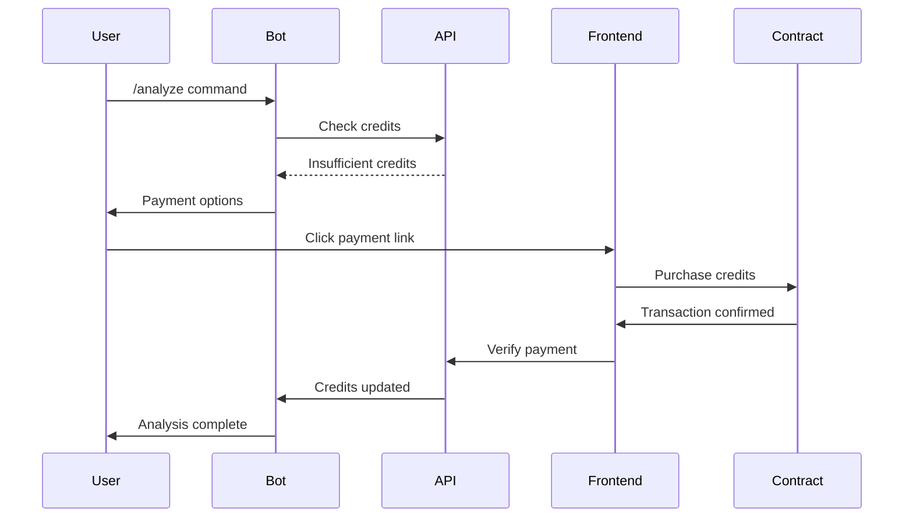

# FinRizz Credits & Payment System

Complete Web3 payment integration for FinRizz premium credits using Thirdweb on 0G Galileo Testnet.

## Architecture Overview

```
Telegram Bot → Credits API → Smart Contract → 0G Galileo Testnet
     ↓              ↓              ↓              ↓
User Request → Credit Check → Payment Flow → Transaction
```

## Components

### 1. Smart Contract (`contracts/FinRizzCredits.sol`)
- **Network**: 0G Galileo Testnet (Chain ID: 16602)
- **Features**:
  - Credit purchase with 0G tokens
  - Package pricing (10, 50, 100 credits)
  - User balance management
  - Owner-controlled credit consumption
  - Withdrawal functions

### 2. Payment Frontend (`frontend/src/`)
- **PaymentModule.tsx**: React component with Thirdweb integration
- **Payment.tsx**: Full payment page with user flow
- **web3.ts**: Utility services for 0G network configuration

### 3. Credits API (`backend/credits-api.ts`)
- **Endpoints**:
  - `POST /api/verify-payment` - Verify blockchain transaction
  - `GET /api/credits/{userId}` - Check user balance
  - `POST /api/consume-credits` - Deduct credits for analysis
  - `GET /api/payment-config` - Get pricing and network config

### 4. Telegram Bot (`agentic_backend/bot.py`)
- **Credit Integration**:
  - Check user credits before analysis
  - Consume credits for premium features
  - Payment keyboard with Web3 links
  - Balance display and management

## Setup Instructions

### Prerequisites
1. Node.js 18+
2. Python 3.8+
3. MetaMask wallet
4. 0G Galileo testnet tokens

### 1. Smart Contract Deployment

```bash
# Install dependencies
cd scripts
npm install

# Set environment variables
export THIRDWEB_CLIENT_ID="your_client_id"
export PRIVATE_KEY="your_private_key"

# Deploy contract
npm run deploy
```

### 2. Backend API Setup

```bash
# Install dependencies
cd backend
npm install

# Configure environment
cp .env.example .env
# Edit .env with your values

# Start API server
npm run dev
```

### 3. Frontend Setup

```bash
# Install dependencies  
cd frontend
npm install

# Configure environment
echo "VITE_THIRDWEB_CLIENT_ID=your_client_id" > .env.local

# Start development server
npm run dev
```

### 4. Telegram Bot Setup

```bash
# Install dependencies
cd agentic_backend
pip install -r requirements.txt

# Configure environment
export TELEGRAM_TOKEN="your_bot_token"
export CREDITS_API_URL="http://localhost:3001/api"

# Start bot
python bot.py
```

## Payment Flow

### User Journey
1. User sends `/analyze` command to Telegram bot
2. Bot checks user credit balance via API
3. If insufficient credits, bot displays payment options
4. User clicks payment link → opens Web3 payment page
5. User connects MetaMask and completes transaction
6. Smart contract updates user balance
7. User returns to Telegram to use premium features

### Technical Flow


## Configuration

### Network Settings
```javascript
const ogGalileoTestnet = {
  id: 16602,
  name: "0G Galileo Testnet",
  nativeCurrency: {
    name: "0G",
    symbol: "0G",  
    decimals: 18,
  },
  rpc: "https://evmrpc-testnet.0g.ai",
  blockExplorer: "https://chainscan-galileo.0g.ai"
};
```

### Credit Packages
- **10 Credits**: 0.001 0G
- **50 Credits**: 0.0045 0G (10% discount)  
- **100 Credits**: 0.008 0G (20% discount)

### Usage Costs
- Token Analysis: 1 credit
- Discovery Search: 1 credit
- 0G Network Intel: 1 credit

## Environment Variables

### Backend API (.env)
```
THIRDWEB_CLIENT_ID=your_thirdweb_client_id
CREDITS_CONTRACT_ADDRESS=deployed_contract_address
PORT=3001
CHAIN_ID=16602
RPC_URL=https://evmrpc-testnet.0g.ai
```

### Frontend (.env.local)
```
VITE_THIRDWEB_CLIENT_ID=your_thirdweb_client_id
```

### Telegram Bot
```
TELEGRAM_TOKEN=your_telegram_bot_token
CREDITS_API_URL=http://localhost:3001/api
```

## API Reference

### Credits API

#### Check Credits
```http
GET /api/credits/{telegramUserId}
```

Response:
```json
{
  "success": true,
  "data": {
    "userId": "123456789",
    "credits": 5
  }
}
```

#### Consume Credits
```http
POST /api/consume-credits
Content-Type: application/json

{
  "telegramUserId": "123456789",
  "creditsToConsume": 1
}
```

#### Verify Payment
```http
POST /api/verify-payment
Content-Type: application/json

{
  "telegramUserId": "123456789", 
  "transactionHash": "0x...",
  "creditsAmount": 10
}
```

## Security Features

### Smart Contract Security
- OpenZeppelin contracts for standard security patterns
- ReentrancyGuard for payment protection
- Owner-only functions for credit consumption
- Automatic refunds for overpayment

### API Security
- Input validation and sanitization
- Rate limiting (configurable)
- CORS protection
- Transaction verification

### Frontend Security
- Thirdweb secure wallet connections
- No private key storage
- Smart contract interaction validation
- User-friendly error handling

## Testing

### Smart Contract Tests
```bash
cd contracts
npx hardhat test
```

### API Tests  
```bash
cd backend
npm test
```

### Integration Testing
1. Deploy contract to testnet
2. Fund test wallet with 0G tokens
3. Test complete payment flow
4. Verify credit balance updates
5. Test Telegram bot integration

## Deployment

### Production Checklist
- [ ] Deploy smart contract to 0G mainnet
- [ ] Update all contract addresses
- [ ] Configure production API endpoints
- [ ] Set up database (PostgreSQL recommended)
- [ ] Configure domain for payment frontend
- [ ] Update Telegram bot webhook
- [ ] Test end-to-end flow
- [ ] Monitor transaction logs

### Scaling Considerations
- Database migration from in-memory to PostgreSQL
- Redis for session management
- Load balancing for API endpoints
- CDN for frontend assets
- Webhook reliability for Telegram

## Troubleshooting

### Common Issues

#### "Transaction Failed"
- Check 0G token balance
- Verify network connection
- Ensure correct contract address

#### "Credit Check Failed"  
- Verify API endpoint is running
- Check database connection
- Validate user ID format

#### "Payment Not Recognized"
- Allow time for blockchain confirmation
- Check transaction hash validity
- Verify smart contract logs

## Support

### Resources
- [0G Network Documentation](https://docs.0g.ai)
- [Thirdweb Documentation](https://portal.thirdweb.com)
- [Telegram Bot API](https://core.telegram.org/bots/api)

### Community
- Discord: [0G Network Discord](https://discord.gg/0g)
- GitHub: [FinRizz Repository](https://github.com/your-repo/finrizz)

---

**Built with ❤️ for ETH Global Hackathon**  
*Powered by 0G Network, Thirdweb, and AI*